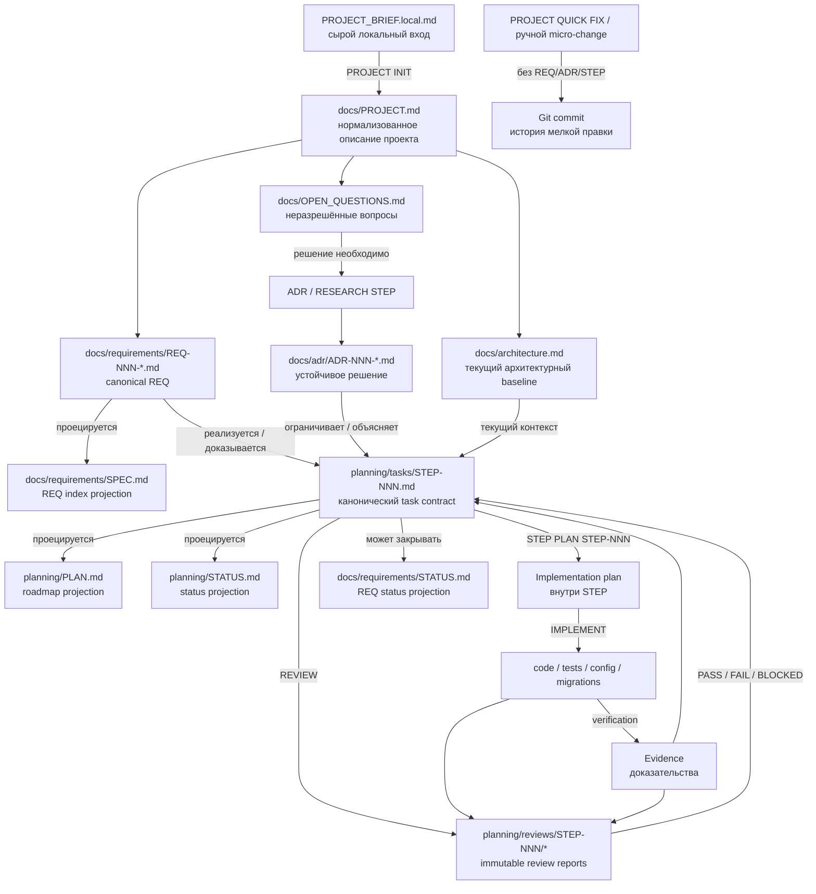

# Модель документации и traceability

Harness разделяет **идею продукта**, **требования**, **архитектурные решения**, **работу**, **фактическую реализацию** и **доказательства**. Это предотвращает ситуацию, когда один большой документ одновременно пытается быть ТЗ, roadmap, changelog и архитектурой.

## Общая схема



## Что означает направление стрелок

| Связь | Смысл |
|---|---|
| `PROJECT → REQ` | описание проекта нормализуется в проверяемые продуктовые контракты |
| `PROJECT → architecture` | из целей и ограничений формируется текущий архитектурный baseline |
| `Open Question → ADR/RESEARCH STEP` | неопределённость сначала исследуется, а не маскируется выдуманным решением |
| `REQ → SPEC` | `SPEC.md` — компактный индекс canonical REQ-файлов, а не competing source определения требования |
| `REQ → STEP` | STEP реализует или предоставляет evidence для одного или нескольких требований |
| `ADR → STEP` | Accepted ADR ограничивает способ реализации STEP |
| `architecture → STEP` | STEP обязан учитывать текущее устройство системы |
| `STEP → PLAN / STATUS` | `PLAN.md` и `STATUS.md` — производные проекции task-файлов, а не самостоятельный competing truth |
| `STEP → Implementation plan` | `STEP PLAN STEP-NNN` сохраняет технический handoff прямо в task-файл |
| `Implementation plan → code/tests/config` | implementer реализует уже зафиксированный план |
| `code/tests/config → Evidence` | фактические проверки и артефакты доказывают выполнение acceptance criteria |
| `Evidence → STEP` | task хранит ссылки на конкретные доказательства, а не фразу «работает» |
| `STEP + implementation + Evidence → Review` | независимый reviewer сверяет ожидаемое и фактическое состояние |
| `Review → STEP` | verdict определяет, можно ли закрывать STEP или требуется FIX |
| `STEP → REQ status` | требование меняет статус только если STEP действительно доказал необходимый контракт; текущее lifecycle-состояние отражается только в `docs/requirements/STATUS.md` |
| `PROJECT QUICK FIX → Git commit` | безопасная мелкая правка не создаёт искусственные REQ/ADR/STEP; её достаточная история — проверенный Git diff/commit |

## Canonical и projection files

**Canonical file** — основной источник конкретного факта. **Projection** — удобное производное представление, которое должно синхронизироваться с canonical source.

Примеры:

- `planning/tasks/STEP-NNN.md` — canonical task contract;
- `planning/PLAN.md` — roadmap projection по всем STEP;
- `planning/STATUS.md` — status projection;
- `docs/requirements/REQ-NNN-*.md` — canonical requirement definitions;
- `docs/requirements/SPEC.md` — index projection по canonical REQ;
- `docs/requirements/STATUS.md` — единственная persisted requirement status projection, вычисляемая из STEP/evidence/review.

Если projection расходится с canonical source и фактическим code/evidence, projection исправляется после проверки, а не становится новой истиной. Для REQ definition/rationale/acceptance/traceability остаются в отдельном `REQ-NNN-*.md`; `SPEC.md` содержит только индекс, а lifecycle-state — только `STATUS.md`.

Legacy-проекты, инициализированные старым Harness, могут всё ещё хранить canonical REQ внутри монолитного `SPEC.md` и/или содержать `**Статус:**` рядом с definition. `HARNESS UPDATE APPLY` не разрезает такие project-owned документы автоматически. `PROJECT RECONCILE` выполняет lossless migration: каждый requirement переносится в отдельный `REQ-NNN-*.md` по текущему `docs/requirements/TEMPLATE.md` с сохранением ID, названия, metadata, Requirement, Rationale, Acceptance и Traceability без изменения смысла; `SPEC.md` и `STATUS.md` перестраиваются в текущий projection-format с сохранением lifecycle-state/coverage/evidence. Если lossless отображение в текущую модель неоднозначно, migration блокируется вместо угадывания.

`.harness/tools/validate.py` проверяет структурную согласованность `REQ-NNN-*.md ↔ SPEC.md ↔ STATUS.md`: ID, filename/H1, обязательные standalone-секции, projection coverage, прямые ссылки на canonical-файлы и названия. Семантику требований validator намеренно не оценивает.

## Иерархия источников истины

При конфликте Harness использует порядок:

1. фактический `code / migrations / config / tests` — **что реально реализовано сейчас**;
2. Accepted ADR — **какой устойчивый архитектурный контракт должен соблюдаться**;
3. architecture/subsystem docs — **актуальное объяснение устройства системы**;
4. requirements — **что продукт обязан обеспечивать**;
5. STEP — **scope конкретной работы**;
6. PLAN/STATUS и requirements SPEC/STATUS — **проекции**;
7. brief/chat/неформальные заметки — входной контекст, но не permanent truth.

Этот порядок не означает, что code автоматически «прав» при конфликте с ADR. Такое расхождение называется **architecture drift** и должно быть явно зафиксировано и разрешено.

## Durable handoff между агентами

Harness не полагается на историю чата:

```text
ADD  → task contract
PLAN → Implementation plan в STEP
IMPLEMENT → code/tests + verification evidence
REVIEW → immutable review report
FIX → изменения по конкретным findings
RECONCILE → audit report / corrective STEP
```

Поэтому новую сессию можно начать с репозитория без пересказа предыдущего разговора.

## Где читать определения

Полные определения `REQ`, `ADR`, `STEP`, `Evidence`, `Projection`, `Drift`, `Gate`, `Finding`, `Verdict` и остальных терминов находятся в [`GLOSSARY.md`](GLOSSARY.md).
